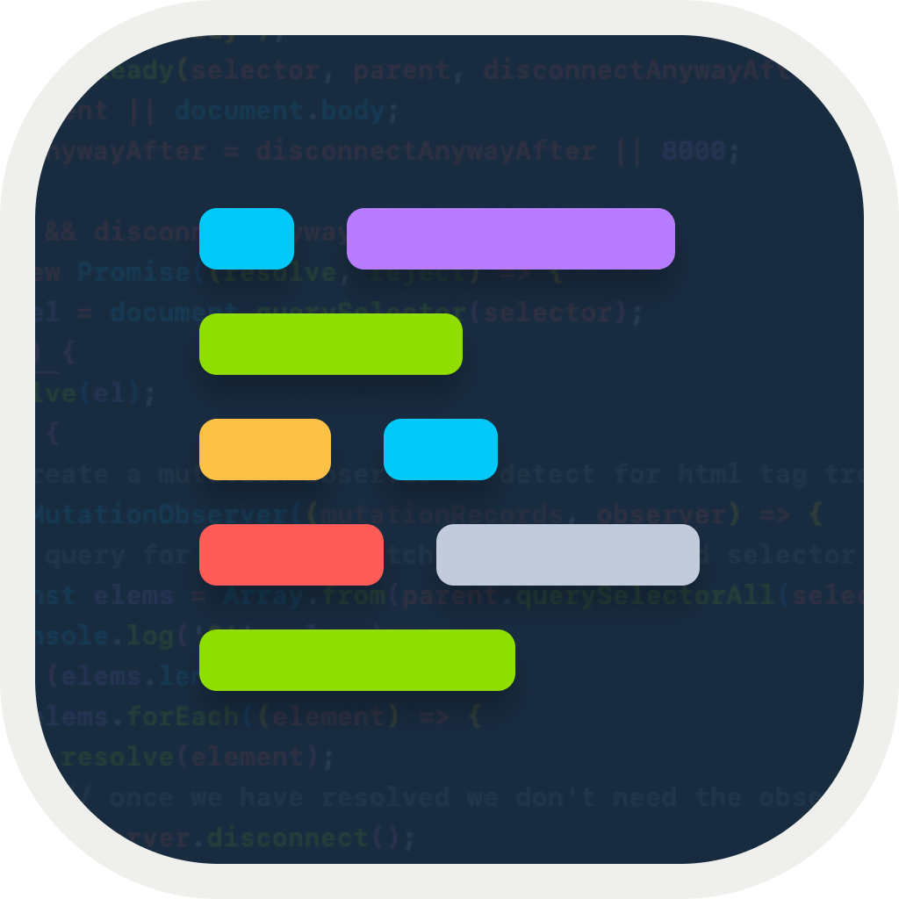
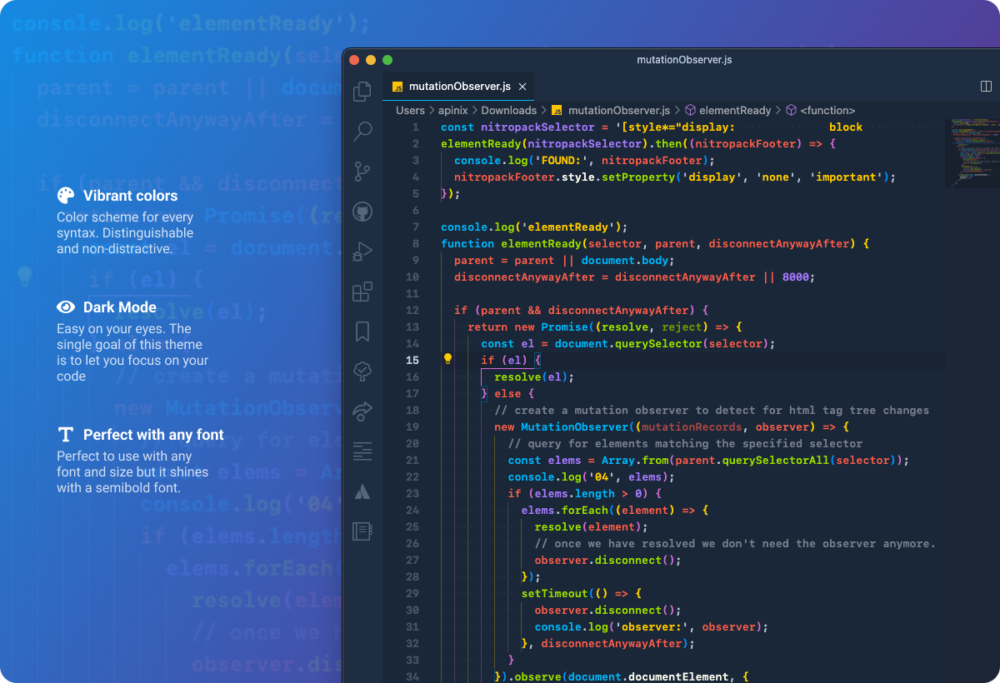

# aPinix Theme

<!-- <p>
  <a href="https://marketplace.visualstudio.com/items?itemName=softwaredotcom.apinix-theme-vscode">
    
  </a>
  <a href="https://marketplace.visualstudio.com/items?itemName=softwaredotcom.apinix-theme-vscode">
    
  </a>
  <a href="https://marketplace.visualstudio.com/items?itemName=softwaredotcom.apinix-theme-vscode">
    
  </a>
</p> -->

<p></p>

---

[aPinix Theme](https://marketplace.visualstudio.com/items?itemName=aPinix.apinix-theme) A VSCode Dark Theme based on Monokai theme. Ease on your eyes. Code till you fall asleep.



## My font setup

```text
SF Mono Semibold 13px
```

## Inconsistencies?

If you find any inconsistency in any language, raise an Issue and I'll fix it, please provide a sample for the language so I can compare.
